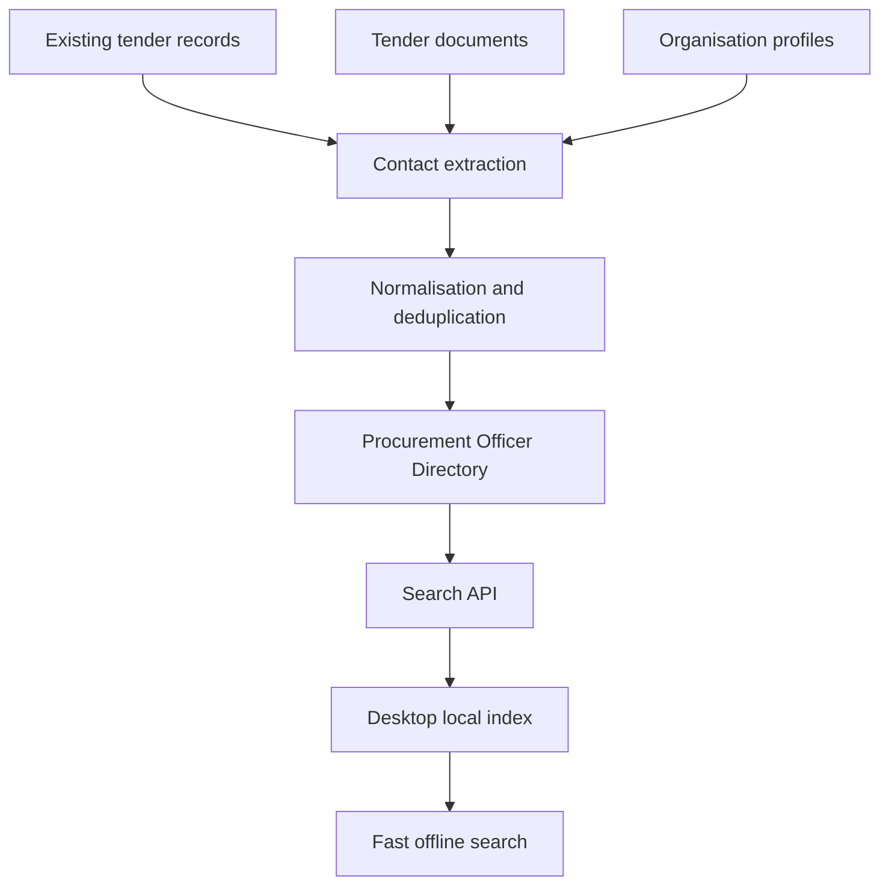

Yes. Because Tenders‑SA already stores procurement contacts against tender records, this is mainly a data consolidation, search, and verification feature—not a completely new data-acquisition system.

The important limitation: it should be marketed as “known procurement officers found in Tenders‑SA records,” not a complete national register.

## Feature: Procurement Officer Directory

### Core capability

Desktop users should be able to search by:

* Officer name
* Procuring organisation
* Municipality or government department
* Province
* Job title or procurement role
* Email address
* Telephone number
* Tender number
* Procurement category

Each result should show:

* Full name
* Current known title
* Organisation
* Official email and telephone number
* Organisation’s physical and postal addresses
* Province
* Last observed date
* Number of tender records connected to the officer
* Verification/confidence status
* Source tender records

Only organisational addresses should be displayed—never residential addresses.

## Recommended architecture



The central Tenders‑SA database remains authoritative. The desktop application receives a compact, periodically updated local index for immediate and partially offline search.

## Data model

### `procurement_officers`

* `id`
* `canonical_name`
* `first_name`
* `last_name`
* `current_title`
* `current_organisation_id`
* `province`
* `status`
* `confidence_score`
* `first_seen_at`
* `last_seen_at`
* `verified_at`

### `officer_contact_points`

* `officer_id`
* `type`: email, telephone, mobile, fax
* `value`
* `is_role_based`
* `is_official`
* `first_seen_at`
* `last_seen_at`
* `verification_status`

### `officer_assignments`

This prevents old employment records from being presented as current.

* `officer_id`
* `organisation_id`
* `title`
* `valid_from`
* `valid_to`
* `is_current`
* `confidence_score`

### `officer_evidence`

Every fact should be traceable.

* `officer_id`
* `tender_id`
* `document_id`
* `source_url`
* `source_field`
* `observed_at`
* `extraction_method`
* `extraction_confidence`

## Entity resolution

This is the most important technical component.

Contacts should be matched using:

1. Exact official email match
2. Exact telephone match
3. Normalised name plus organisation
4. Name, title and organisational domain
5. Fuzzy name matching only when supported by additional evidence

Do not automatically merge two people based only on a similar name. Ambiguous matches should enter an administrative review queue.

The system must also distinguish:

* A named officer: `Thabo Mokoena`
* A role mailbox: `tenders@department.gov.za`
* A procurement office: `Supply Chain Management Unit`

Role-based contacts should remain searchable but should not be falsely presented as individuals.

## Desktop interface

Add a top-level navigation item:

**Procurement Officers**

The screen should contain:

* Universal search bar
* Province, organisation, role and verification filters
* Recent searches
* Saved officers
* Result list with confidence and freshness indicators
* Officer detail panel
* Related tenders and organisations
* “Report incorrect information” action

Useful actions:

* Copy official email
* Copy telephone number
* Open email client
* Open organisation profile
* View associated tenders
* Save to workspace
* Add private desktop notes
* Export an individual contact

Avoid unrestricted bulk contact exports in the first release.

## Search implementation

For speed:

* Central API: PostgreSQL full-text search plus trigram indexes
* Desktop cache: SQLite FTS5
* Background incremental synchronisation
* Search-as-you-type with a 150–250 ms debounce
* Local results first, followed by refreshed server results
* Index names, aliases, organisations, roles, emails and tender numbers

Suggested API:

```http
GET /api/v1/procurement-officers/search?q=mokoena&province=gauteng
GET /api/v1/procurement-officers/{id}
GET /api/v1/procurement-officers/{id}/tenders
GET /api/v1/procurement-officers/sync?cursor={cursor}
POST /api/v1/procurement-officers/{id}/corrections
```

## Data quality labels

Every result should display one of:

* **Verified** — confirmed through an official and recent source
* **Recently observed** — appeared in a recent tender
* **Historical** — valid previously but may have changed
* **Unverified** — extracted but not sufficiently corroborated

A practical freshness rule:

* Current: observed within 12 months
* Possibly outdated: 12–24 months
* Historical: older than 24 months

These thresholds should be configurable.

## POPIA controls

This directory must be limited to official procurement-related business information.

Required controls:

* Exclude personal/home addresses
* Exclude private email addresses
* Exclude unconfirmed personal mobile numbers
* Preserve the source and purpose for every data point
* Provide correction, objection and removal procedures
* Record who accessed or exported information
* Apply role-based access and subscription limits
* Separate directory access from marketing consent
* Publish a clear privacy notice
* Automatically suppress disputed information during review

POPIA gives data subjects rights relating to notification, access, correction, deletion and objection. It also places additional restrictions on unsolicited electronic direct marketing. Directory access must therefore not be presented as permission to send marketing messages. See the [Protection of Personal Information Act](https://inforegulator.org.za/wp-content/uploads/2025/08/PROTECTION-OF-PERSONAL-INFORMATION-ACT-4-OF-2013.pdf) and the Information Regulator’s [direct-marketing guidance](https://inforegulator.org.za/popia/).

## Delivery plan

### Phase 1 — Data audit: 2–3 days

* Count unique tender contact names, emails and telephone numbers
* Measure organisation and address coverage
* Identify duplicates and conflicting records
* Determine how many contacts have been seen recently
* Produce an estimated national coverage percentage

### Phase 2 — Directory backend: 5–7 days

* Add directory tables
* Build normalisation and entity-resolution jobs
* Connect officers to organisations and tenders
* Add confidence and freshness scoring
* Create administrative review queue

### Phase 3 — Search and synchronisation: 3–5 days

* Implement search endpoints
* Add PostgreSQL indexes
* Create desktop SQLite index
* Implement incremental desktop synchronisation

### Phase 4 — Desktop interface: 5–7 days

* Build directory screen
* Add search filters and officer profiles
* Add saved contacts and local notes
* Add related tender and organisation navigation
* Add correction reporting

### Phase 5 — Verification and release: 3–5 days

* Review false merges
* Test outdated employment handling
* Perform access-control and privacy testing
* Add usage analytics and audit logging
* Release initially as a beta intelligence feature

## Expected effort

A usable MVP should take approximately **3–4 weeks**. A basic search across raw tender contacts could be built faster, but it would produce duplicates, stale contacts and misleading officer assignments.

The best product positioning would be:

> Search verified and historically observed procurement contacts across South African public-sector tender records.

This could become one of the desktop application’s strongest Company Intelligence features, especially when connected to organisation profiles, tender histories, saved workspaces and procurement activity.
